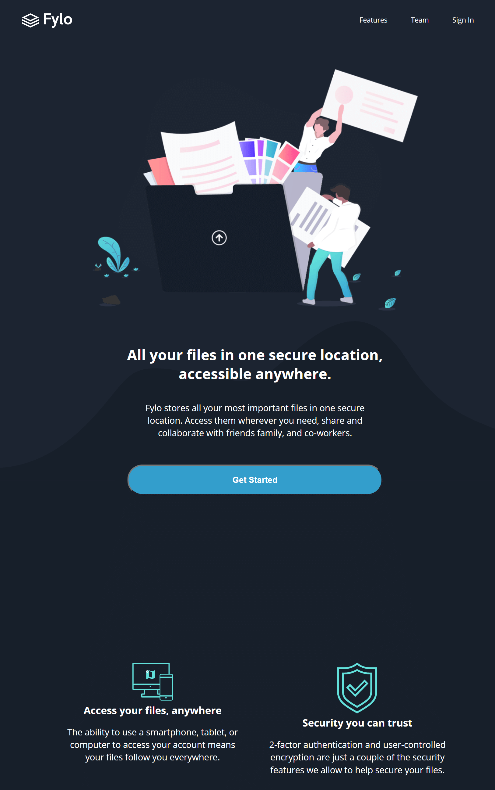

# Frontend Mentor - Fylo dark theme landing page solution

This is a solution to the [Fylo dark theme landing page challenge on Frontend Mentor](https://www.frontendmentor.io/challenges/fylo-dark-theme-landing-page-5ca5f2d21e82137ec91a50fd). Frontend Mentor challenges help you improve your coding skills by building realistic projects.

## Table of contents

-  [Overview](#overview)
   -  [The challenge](#the-challenge)
   -  [Screenshot](#screenshot)
   -  [Links](#links)
-  [My process](#my-process)
   -  [Built with](#built-with)
   -  [What I learned](#what-i-learned)
   -  [Continued development](#continued-development)
   -  [Useful resources](#useful-resources)
-  [Author](#author)

## Overview

### The challenge

Fylo dark theme landing page
Users should be able to:

-  View the optimal layout for the site depending on their device's screen size
-  See hover states for all interactive elements on the page

### Screenshot

{:height="50%" width="50%"}

### Links

-  Solution URL: [Code](https://github.com/JC-d3v/demos/tree/master/fylo-dark-theme-landing-page)
-  Live Site URL: [Fylo dark theme landing page](https://jc-d3v.github.io/demos/fylo-dark-theme-landing-page/index.html)

## My process

### Built with

-  Semantic HTML5 markup
-  CSS custom properties
-  CSS Grid
-  Mobile-first workflow

### What I learned

I learned that is more easy to me to usar my own color palette.

### Continued development

I will practice with relative positions and backgrounds in responsive design.

### Useful resources

.

## Author

-  Website - [R. Jorge Calderon V.](https://github.com/JC-d3v)
-  Frontend Mentor - [@JC-d3v](https://www.frontendmentor.io/profile/JC-d3v)
